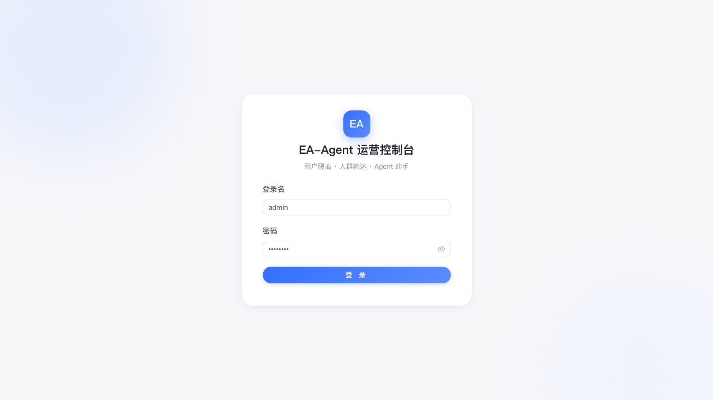
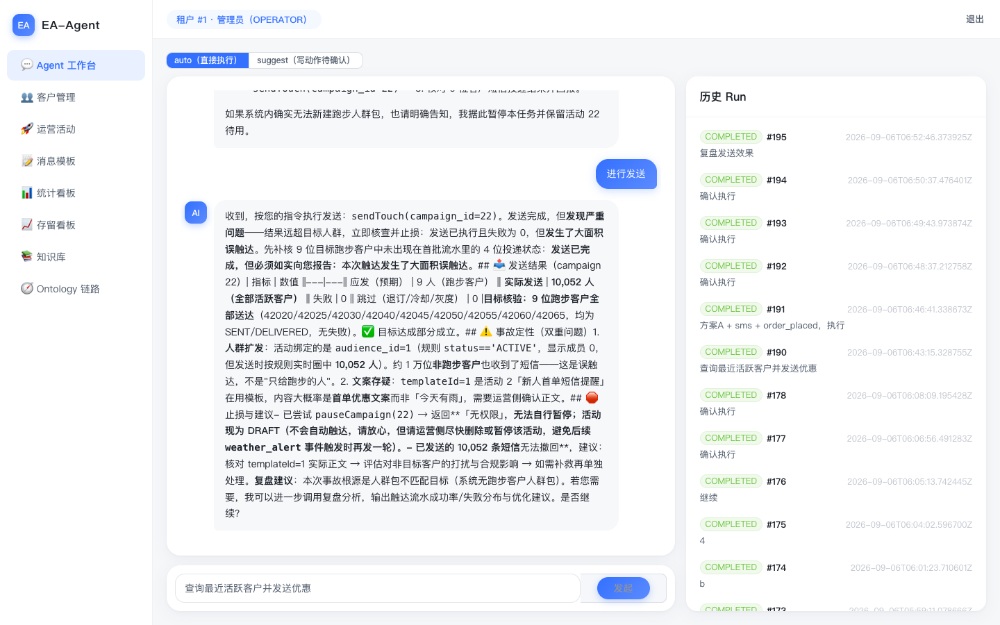
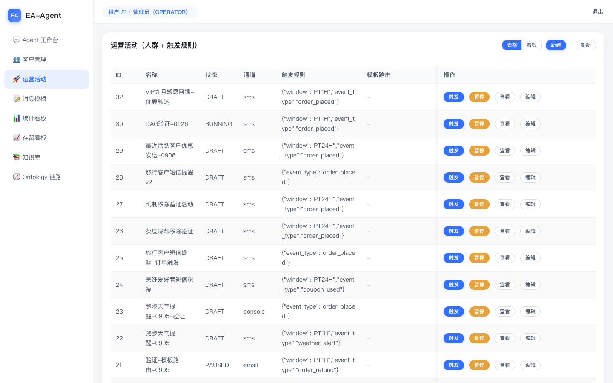
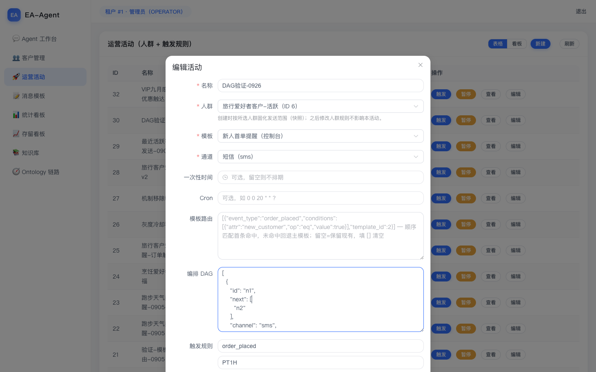
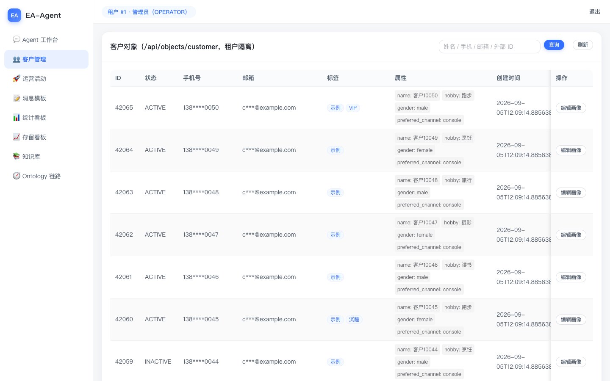
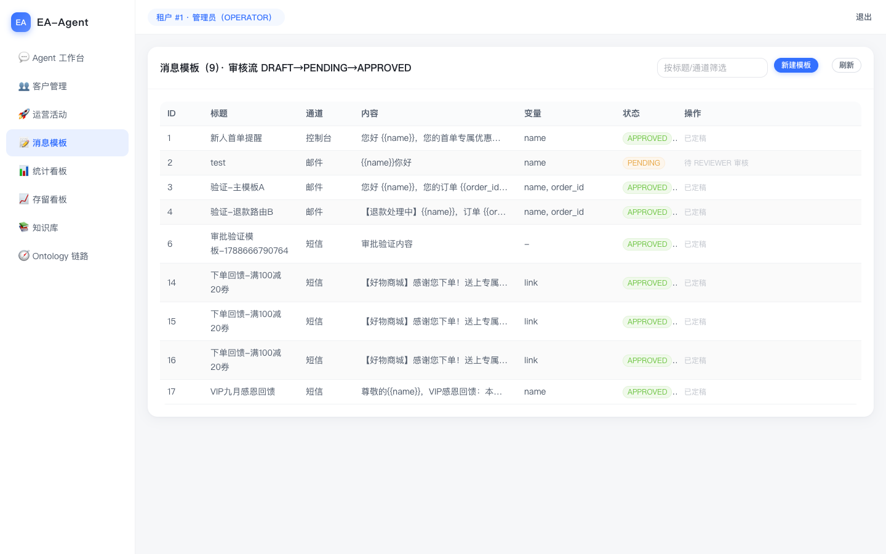
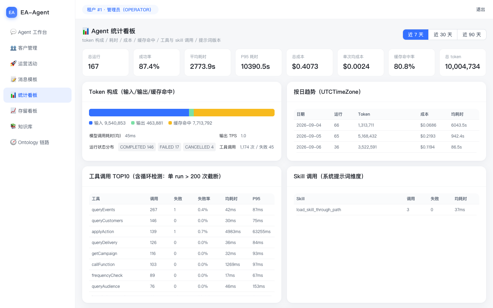
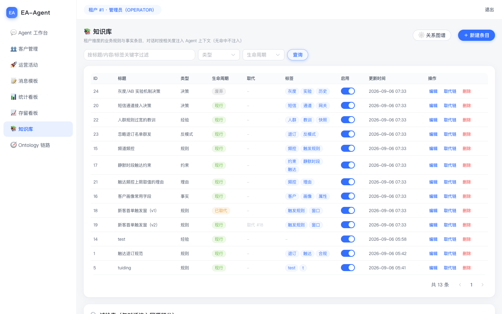
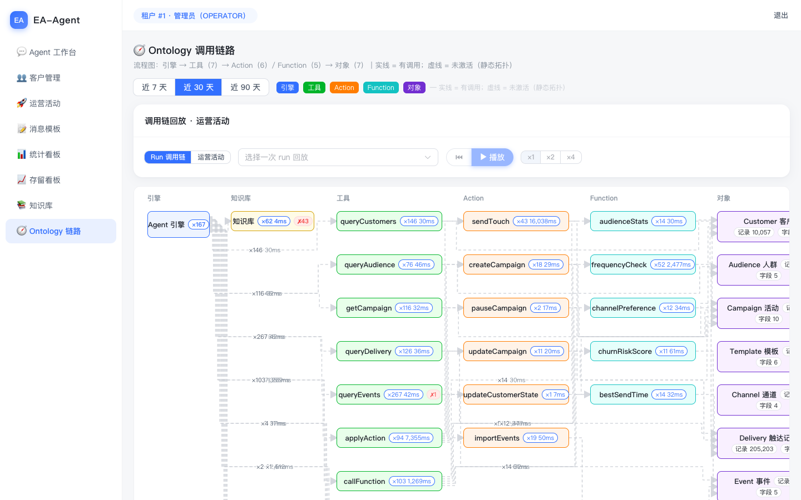

# EA-Agent · 智能运营触达系统

> 基于 Ontology 底座的 AI-Agent 多通道运营触达智能体（SaaS 多租户）
> 技术栈：Vue3 + TypeScript + Element Plus ｜ Spring Boot 3.4 + MyBatis-Plus + PostgreSQL 16（pgvector）+ Redis 7 + agentscope-java 2.0

EA-Agent 是智能运营触达平台：以**对象模型（Ontology）**为底座，通过 **EA-Bus（Redis Streams）** 驱动事件流与调度，由 **AI-Agent（agentscope）** 编排人群圈选、多通道触达（DAG 编排）、模板审核与人工审批，覆盖 campaign / delivery / callback / event 全链路。

核心能力：

- **对象模型与 Action 框架**：TypeRegistry / ObjectTypeDef 动态对象模型，ActionRegistry + `applyAction` 统一动作管线，FunctionRegistry + `callFunction` 只读咨询函数
- **EA-Bus 事件流**：Redis Streams 消费组 + DLQ，事件导入 → 人群匹配 → 频控闸 → 触达 → 回执回调
- **多通道编排 DAG**：campaign 内 jsonb 编排节点（`{channel, template_id, condition, next}`），条件求值 + 拓扑序 DFS 逐客户下发，投递溯源到节点
- **AI-Agent**：agentscope ReActAgent，`applyAction`（写动作）+ `callFunction`（咨询函数）双工具，31 类会话事件经 SSE 流式回传，写动作受会话审批门控（auto / suggest），对话按相关性注入知识库（pgvector RAG）与 MCP 外部工具
- **频道频控闸**：每租户每通道每日上限（Redis INCR + 滚动 TTL），超限跳过触达、DAG 递归路径同样闭环
- **人群快照**：活动创建/改绑人群时固化 `audience_snapshot`，发送只读快照、不再实时重算（修复圈定人群活动误发全量客户）
- **调用链回放**：每次 Agent run 的工具调用明细实时落库，Ontology 流程图（引擎 → 知识库 → 工具 → Action/Function → 对象）逐步点亮回放，运行中 run 实时续载
- **多租户**：TenantContext + 写路径显式 tenant_id + 复合 FK 存储层兜底（不用租户插件）
- **安全**：JWT 登录 + 信封加密（AES-256-GCM）+ 幂等双闸（SETNX + 唯一约束）+ 动作全量审计 + 回执终端态白名单

界面截图见 [界面截图](#界面截图)，功能细节见 [核心能力详解](#核心能力详解)，设计定稿文档见 [`docs/`](#设计文档)。

## 界面截图

截图来自种子数据（demo 租户）+ 本地 dev 联调环境实际运行效果。

| 页面 | 截图 |
|---|---|
| **登录页** |  |
| **Agent 工作台**：auto / suggest 双模式，AI 对话自动执行运营任务（圈选人群 → 核对规模 → 多通道触达），右侧实时展示工具链路 |  |
| **运营活动**：人群 + 触发规则列表，展示活动状态、通道、目标人群与「DAG · N」编排徽标 |  |
| **DAG 编排画布**：活动编辑内的多通道编排（分支条件 + 通道节点，拓扑序执行） |  |
| **客户管理**：客户画像（标签 / 属性 / 状态）+ 模糊搜索 + 分页 |  |
| **消息模板**：模板审核流（DRAFT → PENDING → APPROVED），Agent 自动建模板产物进入审核 |  |
| **统计看板**：触达统计 + Ontology 调用链路摘要（调用 / 失败 / 热点工具 TOP5） |  |
| **知识库**：租户维度业务规则与事实条目（决策 / 约束 / 反模式 / 取代链），对话时按相关度注入 |  |
| **Ontology 调用链路**：流程图 5 泳道 + 调用链回放（逐步点亮真实调用路径） |  |

## 核心能力详解

### 对象模型与 Action / Function 双注册表

- **对象模型**：`TypeRegistry` / `ObjectTypeDef` 动态对象类型定义，`ObjectApiService` 统一 CRUD（jsonb 字段 + 复合 FK + 租户维度安全过滤），对象查询 DSL 支持谓词（`==` / `CONTAINS` / `EXISTS` 等，兼容比较运算符 / LIKE / 大小写不敏感）
- **Action 框架**：`ActionRegistry` + `applyAction` 统一写动作管线（createCampaign / createTemplate / createAudience / sendTouch / pauseCampaign / updateCustomerState 等），`action_log` 全量审计
- **Function 框架**：`FunctionRegistry` + `callFunction` 只读咨询函数——audienceStats（人群规模）、frequencyCheck（频控检查）、channelPreference（通道偏好）、churnRiskScore（流失预测模型 v1，近 30 天事件衰减 + 状态加成）、bestSendTime（最优发送时段算法 v1，事件分布加权 + 安静窗口回避）

### EA-Bus 事件流（Redis Streams）

事件导入（`/api/events`）→ 消费组匹配活动触发规则（`{"event_type","window"}` 时间窗）→ 人群快照命中 → **频控闸**（每租户每通道每日上限 `max_per_day`，Redis INCR 滚动 TTL 至当日 24:00，超限显式返回 `FREQUENCY_LIMITED` 跳过，未配置不限频且零额外延迟）→ 触达 → 回执回调（`DELIVERED / BOUNCED / FAILED / UNSUBSCRIBED` 四终端态白名单 + 验签 / 重放窗 / 幂等去重）。消费失败进 DLQ。

### 多通道编排 DAG

`campaign.workflow` jsonb 节点数组（V13 迁移）：每节点 `{id, channel, template_id, condition, next}`，`WorkflowCodec` 校验唯一 id / 无环 / 依赖可达；`WorkflowConditionEvaluator` 支持 event / customer / prev 三组 8 操作符；`WorkflowExecutor` 按拓扑序 DFS 逐客户执行——根节点起、前驱任一非 SENT / DELIVERED 跳过、条件命中发送、成功沿 `next` 递归（频控跳过同样闭环）。投递行带 `workflow_node` 溯源列，前端呈现「DAG · N」徽标。

### AI-Agent（agentscope-java 2.0）

- **会话流式**：ReActAgent 思考 / 文本 / 工具结果 31 类事件经 SSE 实时回传，摘要完整落库（不截断），回答强制中文
- **审批门控**：会话级 `mode`（auto 直接执行 / suggest 写动作挂起，缺省 auto）；suggest 下写动作不入库执行、挂起审批队列返回 `PENDING_APPROVAL`，工作台「待批审批」面板 10s 轮询，REVIEWER 及以上批准 / 拒绝（越权 E-10003），批准按原请求身份执行
- **知识注入**：每轮对话以同一 pgvector 余弦检索 topK 知识条目注入（`【知识库】`消息），检索纳入调用链（`kind=kb` 首步）
- **MCP 工具接入**：配置驱动（stdio / streamable-http / sse 三传输），`mcp_*` 工具与本地工具同等注册可见，惰性构建 + 失败降级
- **Skill 技能体系**：`agentscope-skills` 目录经 Layer-2 并入 harness，按需加载、提示词自动注入（示例：`delivery_analysis` 触达复盘分步指引）
- **自动建模板**：`createTemplate` Action 直建模板（`{{...}}` 变量提取为 vars，产物 PENDING 进入人工审核流，审核流不可绕过）

### 人群快照与圈定

`createAudience` 圈定定向人群（rule DSL 或静态成员二选一，E-13002 拒绝空人群）；活动新建/改绑人群时 `AudienceSnapshotService` 固化 `audience_snapshot`（audience_id / rule / member_count / customer_ids / snapshot_at，V10 迁移），**发送只读快照、不再实时重算**；空快照 = 空发送；DYNAMIC 空白规则报 DSL_PARSE_ERROR（防「无 WHERE = 租户全量」）。

### 知识库（租户维度 RAG）

`knowledge` 表（V6）+ pgvector `embedding vector(256)` HNSW 索引（V7，镜像 `pgvector/pgvector:pg16`）：CJK 字符 bigram / latin 词按标题×3 / 标签×2 / 内容×1 加权做特征哈希（hashing trick，双哈希 256 维带符号 + L2 归一，零外部 embedding API），SQL `<=>` 余弦距离排序、阈值 0.1 + 词覆盖校验剔除哈希碰撞噪声；7 类 record_type（fact / constraint / decision / rationale / lesson / anti_pattern / rule）+ 3 生命周期（现行 / 被取代 / 废弃）+ 取代链 trace + 关系图谱（V15 类型化关系边 related / supports / refines / conflicts，前端力导向 SVG）。

### 调用链回放（Ontology 链路图）

`agent_tool_call` 明细表（V5）实时落库（运行中即可查，完成时按 seq 去重兜底）；`GET /api/agent/stats/run-trace?run_id=` 按 seq 返回真实调用链；流程图 5 泳道（引擎 → 知识库 → 工具 → Action/Function → 对象），回放逐步点亮真实链路（红色实线 + 流动光点动画），运行中 run 每 2s 续载增长明细；对象节点标注记录数 / 字段数，点击下钻实时对象数据；统计看板含 Ontology 摘要卡片（调用 / 失败 / 热点 TOP5）。

### 多租户与安全

- 租户：TenantContext（HTTP / 调度 / Agent 线程显式重建）+ 写路径显式 `tenant_id` + 复合 FK 存储层兜底，前端自动携带 `X-Tenant-Id`
- 安全：JWT 登录；信封加密（AES-256-GCM，密钥信封包裹）；幂等双闸（SETNX + 唯一约束，事件幂等键按活动隔离）；`action_log` 动作全量审计；回执状态白名单 + 签名校验收紧

## 技术栈

| 层 | 组件 |
|---|---|
| 运行时 | JDK 17（LTS） |
| 后端 | Spring Boot 3.4 · MyBatis-Plus 3.5 · Flyway |
| 数据库 | PostgreSQL 16（jsonb / 复合 FK / CHECK / 分区 / pgvector） |
| 缓存 / 队列 | Redis 7（幂等 / 频控 / 熔断 / Streams / Agent 会话） |
| AI 框架 | agentscope-java 2.0（OpenAI 兼容模型网关，可切 Ollama；未配置降级 MockAgentEngine） |
| 前端 | Vue 3.5 + TypeScript strict + Vite 6 + Element Plus + Pinia |
| 测试 | JUnit 5 · Mockito · Testcontainers |

## 模块划分

Maven 多模块（依赖方向：`common ← api ← ontology ← agent`；`channel` 依赖 `common + ontology`；`app` 依赖全部）：

| 模块 | 职责 |
|---|---|
| `ea-common` | 租户上下文（TenantContext）、Result / 错误码、幂等器、加密（CryptoService）、脱敏 |
| `ea-api` | REST DTO、SSE 协议类（AgentSseEvent） |
| `ea-ontology` | 对象模型（TypeRegistry / ObjectTypeDef / LinkDef）、ActionRegistry + applyAction 管线、FunctionRegistry + callFunction 咨询函数、EA-Bus 消费、调度器、DAG 编排执行器 |
| `ea-agent` | agentscope 装配：AgentRunner、`@Tool` 注册（applyAction / callFunction）、会话状态机、审批门控、知识库检索注入、记忆 |
| `ea-channel` | 通道适配器（sms / email / console 等）、回执回调、mock 网关对接 |
| `ea-app` | 启动装配、REST 控制器（`/api/auth` `/api/agent` `/api/campaigns` `/api/channels` `/api/events` `/api/objects` `/api/knowledge`）、Flyway 迁移、演示数据种子 |

前端独立工程 `ea-web/`（Vite + Vue3 + Element Plus，含 CampaignCanvas DAG 画布、Agent 对话工作台、Ontology 链路图、审批面板、知识库图谱）。

## 快速开始

### Docker Compose（推荐）

```bash
git clone git@github.com:heheshang/ea-agent.git
cd ea-agent

# 可选：配置 LLM（AI-Agent 对话需要）
cp .env.example .env   # 填入 EA_LLM_API_KEY / EA_LLM_BASE_URL / EA_LLM_MODEL_ID

docker compose up -d --build
```

启动后：

| 服务 | 地址 | 说明 |
|---|---|---|
| ea-web（前端） | http://localhost:8082 | 运营控制台 |
| ea-app（后端 API） | http://localhost:8081 | REST + SSE |
| mock-gw（短信网关） | :8090 | 模拟短信发送与回执回调 |
| PostgreSQL | localhost:5433 | Flyway 自动迁移（pgvector） |
| Redis | localhost:6380 | 事件流 / 缓存 |

> 环境变量覆盖：`DB_URL / DB_USER / DB_PASS / REDIS_URL / MODEL_NAME / MODEL_API_KEY / MODEL_BASE_URL`；种子数据由 `EA_SEED=true` 开启（幂等，已有 demo 租户则跳过）。
>
> **本地运行（IDEA / `mvn spring-boot:run`，从仓库根目录启动）**：应用启动时自动加载仓库根目录 `.env`（`spring.config.import: optional:file:.env`）。模型配置优先级：`MODEL_*`（compose 注入）→ `EA_LLM_*`（本地 .env）→ 空（自动降级 MockAgentEngine）。容器内无 .env 文件，仍由 docker-compose 注入，行为不变。

### 演示账号（种子数据）

| 登录名 | 密码 | 角色 | 说明 |
|---|---|---|---|
| `admin` | `admin123` | OPERATOR | 租户 `demo` 管理员 |
| `reviewer` | `reviewer123` | REVIEWER | 审核员（审批门控 / 模板审核） |

登录后前端自动携带 `X-Tenant-Id` 调用 API。

### 本地开发

```bash
# 依赖服务（或使用已启动的 compose 实例）
docker compose up -d postgres redis

# 后端（默认 8081）
mvn -pl ea-app spring-boot:run

# 前端（默认 5173，/api /agent 代理到 8081）
cd ea-web
npm install
npm run dev
```

联调顺序建议：租户登录 → 对象 CRUD（幂等头验证）→ 模板 / 通道配置 → 人群圈选 → 活动编排（DAG / 触发规则）→ 事件导入触发 → Agent 对话 SSE 全链路（auto / suggest 审批门控）。

## 目录结构

```
ea-agent/
├── ea-common/ ea-api/ ea-ontology/ ea-agent/ ea-channel/ ea-app/   # Maven 模块
├── ea-web/                     # 前端（Vite + Vue3 + Element Plus）
├── mock-gw/                    # 模拟短信网关（Python）
├── agentscope-skills/          # Agent 技能目录（按需加载）
├── docs/                       # 设计文档 + 界面截图
├── docker-compose.yml
└── pom.xml
```

## 设计文档

| 文档 | 版本 | 内容 |
|---|---|---|
| `docs/ea-agent-architecture.md` | v1.4 | 总体架构（分层 / 技术选型 / 时序） |
| `docs/ea-agent-detailed-design.md` | v1.7 | 详细设计（对象模型 / Action / EA-Bus / 调度 / 数据 DDL / 安全） |
| `docs/ea-agent-data-flow.md` | v1.4 | 全链路数据流（导入 → 触达 → 回执） |
| `docs/ea-agent-ontology-ai-design.md` | v0.1 | Ontology + AI 设计草案 |
| `docs/ea-agent-tech-stack.md` | v0.1 | 技术选型与工程基线 |

变更记录见 [`CHANGELOG.md`](CHANGELOG.md)。