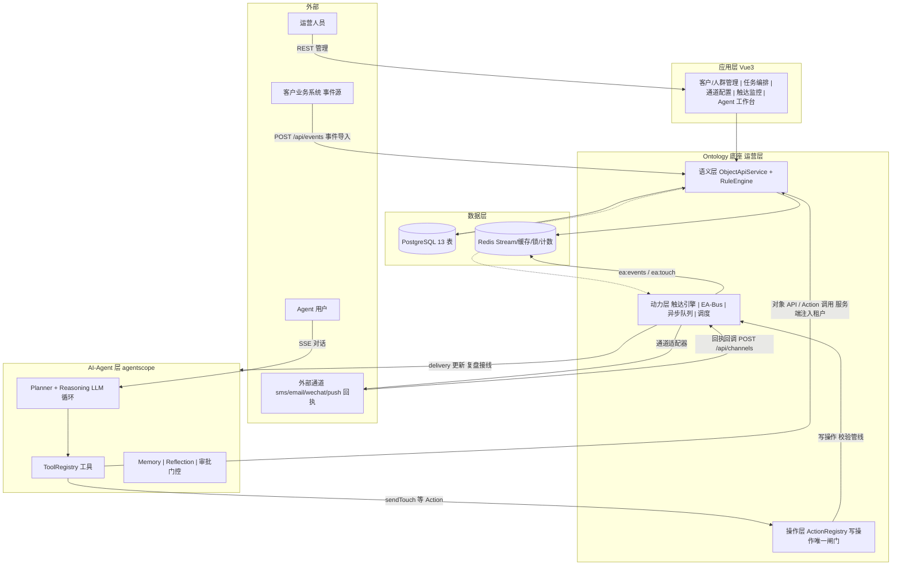
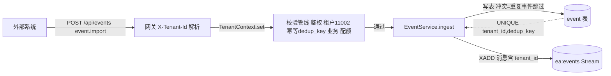
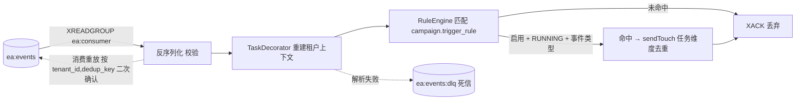
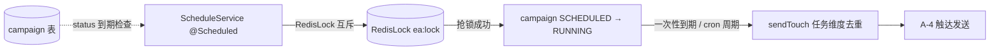
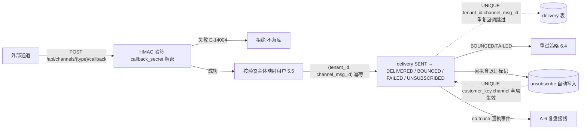
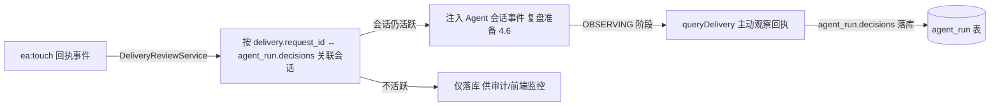
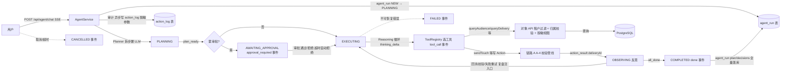
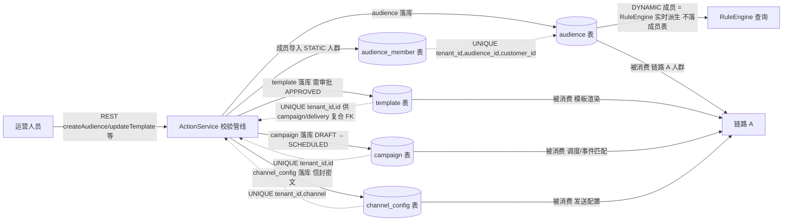

# EA-Agent 全链路数据流程图

> **EA-Agent · 多通道运营触达智能体（SaaS 多租户）**
> 版本：v1.6 · 类型：流程设计文档 · 状态：设计定稿
> 对应：详细设计 v1.7（3.5 事件流 / 3.6 调度 / 6 通道层 / 8 数据架构 / 9 安全 / 10 时序）· 总体架构 v1.5（3.1 分层 / 9.3 时序）· 技术栈设计 v0.1（工程基线）

## 1. 文档定位与图例

本文档用图走通系统全部数据链路：**数据从哪来 → 经过哪些处理 → 落在哪个存储 → 被谁消费 → 流向哪里**。与详细设计逐节对应（见第 9 节对照表），是 10.1/10.3 时序的图化版本，不新增设计决策；术语、命名、编号与详细设计一致。

### 1.1 读图约定

| 元素 | 含义 |
|---|---|
| 外部实体 | 客户业务系统（事件源）、短信/邮件/微信/推送通道、运营人员、Agent 用户 |
| 应用层 / Agent 层 / 底座 | 三层架构（架构 3.1），见各链路标注 |
| PostgreSQL / Redis | 持久化 / 队列缓存，表名与 key 名即数据载体 |
| 实线箭头 | 同步调用（REST / SSE / 方法调用） |
| 虚线箭头 | 异步投递（Redis Stream / 队列 / 事件注入） |
| 标注 `[写表]` / `[唯一约束]` / `[去重]` | 该环节的落库与一致性要点 |

### 1.2 三条链路

- **链路 A：事件驱动触达闭环**（核心主线）—— 外部事件 → 导入 → 匹配 → 触达 → 回执 → 复盘，对应详细设计 10.1 / 10.3；
- **链路 B：Agent 会话闭环** —— 用户对话 → 规划 → 审批 → 执行 → 复盘，SSE 双向流，对应 10.2；
- **链路 C：管理与配置流** —— 人群 / 模板 / 任务 / 通道配置落库，供链路 A/B 消费。

两套事件机制全程区分（详细设计 3.5 术语约定 B）：**EA-Bus**（Redis Stream `ea:events` / `ea:touch`，驱动触达闭环）与 **Agent 会话事件**（agentscope 31 类 → SSE，驱动前端实时交互），互不混称。

## 2. 系统全景

> 图注：三层均运行于租户隔离上下文（识别 / 贯穿 / 强制 / 校验，详细设计 5 章）；LLM 只消费脱敏对象视图（9.6），写操作只能经 Action 闸门（3.4）。

## 3. 链路 A：事件驱动触达闭环

### 3.1 A-1 事件导入

要点：

- 载体：`EventRecord(tenantId, customerId, eventType, payload, dedupKey, createdAt)`（3.5）。
- 落库：`event` 表（8.1）—— `UNIQUE (tenant_id, dedup_key)`（774 行）既是导入幂等键，也天然做重复事件过滤；`customer_id` 复合 FK（769 行）。
- 投递：写库成功后 `XADD ea:events`；field=JSON，**内嵌 tenant_id** 供消费端过滤与上下文重建（5.5）。
- 失败语义：库写失败 → 不投递（事件仅一次候选）；Stream 写失败 → 告警 + 补偿重投。

### 3.2 A-2 消费与匹配

要点：

- 消费组 `ea:consumer`（3.5）：消息处理成功才 XACK；重放由消费端按 `(tenant_id, dedup_key)` 二次确认兜底（容错「成功但未 ACK」）。
- 匹配条件来自 `campaign.trigger_rule` jsonb（8.4）：`{"event_type":"order_placed","window":"1d"}`；window 为事件的匹配时间窗。
- 死信：不可解析消息 → `ea:events:dlq` + 告警，人工/自动化处置（10.3 步骤 6）。

### 3.3 A-3 调度触发（周期任务入口）

要点：

- 调度与事件链路殊途同归：都收敛到 `sendTouch` 或 DAG 执行器（3.6；10.1 步骤 1 同路径）。
- **多通道编排（v1.6）**：`campaign.workflow`（jsonb 节点数组，V13）非空的活动由 `WorkflowExecutor` 按拓扑序逐客户执行——根节点（无入边）开始，前驱任一非 SENT/DELIVERED 则跳过该节点，`condition`（分组 event/customer/prev）命中才 `sendOneCustomer`，成功（SENT/DELIVERED）才沿 `next` 递归推进；每次触达落 `delivery.workflow_node` 标记来源节点。单模板/多路由活动仍走 sendTouch 原管线（零回归）。
- 锁：`RedisLock.tryLock`（2.2）保证多实例只触发一次；暂停 `PAUSED` 跳过；进程崩溃由启动时 `RUNNING + updated_at 超时 → FAILED` 兜底（3.6）。
- 与 A-2 汇合点：事件命中与调度触发都经 ActionService.execute(sendTouch) 或 WorkflowExecutor，共用校验管线与落库。

### 3.4 A-4 触达发送

```mermaid
flowchart LR
  TOUCH["sendTouch Action"] -->|"校验管线"| VL["鉴权 RBAC / 租户11002 / 幂等request_id / 频控13004 / 退订13005 / 时段13007 / 模板审核 / 配额13006"]
  VL -->|"写表 PENDING"| DEL[(delivery 表)]
  DEL -. "UNIQUE tenant_id,request_id 并发兜底" .-> VL
  DEL -->|"XADD 消息含 tenant_id"| TQ[("ea:touch:{tenant}")]
  TQ -->|"消费者 TaskDecorator 重建租户"| AD["ChannelAdapterRegistry.get channel"]
  AD -->|"ConfigCrypto.decrypt 明文仅调用栈"| MB["ChannelMessageBuilder 填模板变量"]
  MB -->|"adapter.send"| CH["外部通道"]
  CH -->|"成功"| UP["delivery SENT + channel_msg_id"]
  MB -->|"变量缺失"| ERR[("失败 参数错误 E-10001")]
  CH -->|"失败 1s/4s/16s ×3"| RT["重试 → 仍失败 FAILED + EA-Bus 告警"]
  WFE["WorkflowExecutor（DAG 活动）"] -->|"按节点 sendOneCustomer（节点通道/模板 + 条件 prev）"| AD
  WFO["EventConsumer 消费命中"] -->|"campaign.workflow 非空 → WorkflowExecutor 拓扑序逐客户 DFS（成功才推进 next）"| WFE
  WFO -->|"campaign.workflow 为空 → sendTouch Action 原管线"| TOUCH
```

要点：

- **发送对象 = 人群快照**：`campaign.audience_snapshot`（jsonb，V10）在活动**创建/改绑人群时**由 `AudienceSnapshotService` 固化（`audience_id/audience_name/mode/rule/member_count/customer_ids/snapshot_at`）；`sendTouch` 只枚举快照成员、**不再对 `audience.rule` 实时重算**（防规则漂移导致全量误发；空快照=发 0 人）。存量无快照活动首次发送前惰性现算并回填 campaign 行。
- **幂等双闸**：Redis `IdempotencyService`（SETNX `ea:idem:{tenant}:{requestId}`，2.2）先滤，`delivery UNIQUE (tenant_id, request_id)`（762 行）落库兜底并发；重复请求返回首次结果。
- 业务校验在写库前完成（9.5）：频控计数 `ea:fc:{tenant}:{channel}:{customerId}:{date}`、退订查 `unsubscribe`（租户级 + 全局 customer_key 匹配，E-13005）、时段 `quiet_hours`（E-13007）——**避免无效 delivery 落库**。
- 明文边界：`channel_config.config_encrypted` / `callback_secret` 均为信封密文（9.3），发送前解密，明文仅存在于服务端调用栈（6.2）。
- 熔断：通道连续失败率超阈值 → `ea:cb:{channel}` 熔断 60s（6.4）；未配置真实通道 → ConsoleChannelAdapter 降级联调。

### 3.5 A-5 回执回调

要点：

- 验签按租户级 secret（密文解密后比对 `X-Signature`），失败即拒、无落库；成功后才按回调路由表映射租户（5.5，外部无 X-Tenant-Id）。
- 回调幂等：`UNIQUE (tenant_id, channel_msg_id)`（763 行）——重复回调天然跳过，`channel_msg_id` 为 NULL 时多条共存安全（Pg 多 NULL 不冲突）。
- 退订闭环：回执带退订标记 → 写 `unsubscribe` + `delivery.status=UNSUBSCRIBED`；全局表 `UNIQUE (customer_key, channel)`（784 行）——任一租户退订即全平台生效（v1.2 定案）。

### 3.6 A-6 复盘接线

要点：

- 接线为**弱接线**（详细设计 B）：`delivery.request_id` 在触达时记录进 `agent_run.decisions`，复盘按此关联，不维护强外键。
- 数据流向：回执结果经 EA-Bus（`ea:touch`）异步回到 Agent 会话 —— **这是两条事件机制唯一交汇点**（10.1 步骤 10）。
- 审计沉淀：`agent_run.decisions` 全量记录决策 + 审批 + 回执摘要，支持回放（9.4）。

## 4. 链路 B：Agent 会话闭环

要点：

- 会话状态机全程持久化：`agent_run`（4.3 八态）落库点为创建（NEW）、审批（AWAITING_APPROVAL）、完成/失败/取消；`plan`/`decisions` 全量可回放（9.4）。
- 工具边界：LLM 只能经 ToolRegistry 白名单调用（9.6）；对象查询强制租户过滤 + `audience.owner_id` 归属校验（5.4，E-12002）；返回 LLM 的数据手机号/邮箱掩码（9.6 脱敏视图）。
- 写操作唯一出口是 Action 管线：工具内的 `sendTouch` 等走链路 A 的完整校验，Agent 无绕过通道；高危动作经权限推断进审批（10.2 步骤 5）。
- **会话审批门控（v1.6）**：web 对话在 POST /api/agent/chat 时携带 `mode`（auto 直接执行 / suggest 写动作挂起），落 `ea:agent:mode:{tenant}:{session}`（TTL 1d）；suggest 模式下 `applyAction` 对写动作（createTemplate/createCampaign/updateCampaign/createAudience/updateCustomerState/pauseCampaign/sendTouch，importEvents 除外）不入库执行，挂起到 Redis List `ea:agent:approval:pending`（entry 含 action/args/状态），返回 `PENDING_APPROVAL`；审批面板 GET /api/agent/approvals 列表、POST /api/agent/approvals/{id}/decision（REVIEWER 及以上）——批准以原请求身份执行动作，拒绝不执行。**createTemplate 产物即 APPROVED**（审批职责由会话门控承担，否则自动模式模板永久拒发）。
- **createTemplate 工具（v1.6）**：`createCampaign` 校验 template_id 缺失或不存在即报可读错误（提示先调 createTemplate）；模板内容变量从 `{{...}}` 提取为 `vars` 返回，供活动编排与条件分支复用。
- 与 EA-Bus 分离：SSE 传的是 Agent 会话事件（4.6 协议表），不回传业务事件流。

## 5. 链路 C：管理与配置流

要点：

- DYNAMIC 人群（v1.1 定案 A）：`audience_member` 仅承载 STATIC；DYNAMIC 的「成员」是 `RuleEngine` 实时执行 `rule` DSL 的派生查询，不落成员表（3.3）——派生查询供 createAudience 预览计数与 queryAudience 展示；**触达一律以 campaign 固化快照为准**（3.4 发送对象 = 人群快照）。
- 模板审核门控：模板须 `APPROVED` 才可被触达复用（发送管线校验）；`template UNIQUE (tenant_id, id)` 供 campaign/delivery 复合 FK（730 行）。
- 复合 FK 纵深：campaign → audience/template、audience_member → audience/customer、delivery → campaign/customer/template 全部 `REFERENCES x(tenant_id, id)`（v1.3 加固）——DDL 层面拒绝跨租户引用，应用层 5.4 归属校验第二道。
- 通道配置密文：`config_encrypted` + `callback_secret` 信封加密（9.3），`UNIQUE (tenant_id, channel)`（742 行）。

## 6. 数据落库总表

13 表（详细设计 8.1 DDL，行号即文档内位置）；写入点/读取点按上文环节标注。

| 表 | 写入点 | 读取点 | 关键约束（行号） | 生命周期 |
|---|---|---|---|---|
| tenant | 平台开通 | 全链路租户解析 | `domain` UNIQUE (636) | 常驻 |
| tenant_user | 租户用户管理 | RBAC、归属校验、Agent 会话 | UNIQUE `(tenant_id,login_name)` (651) + `(tenant_id,id)` (652) | 常驻 |
| customer | 客户导入/对象 API | 触达选人、事件关联、Agent 查询 | UNIQUE `(tenant_id,external_id)` (666) + `(tenant_id,id)` (667) | 常驻 |
| audience | 人群创建（链路 C） | 触达选人、审批展示 | owner FK (676)、UNIQUE `(tenant_id,id)` (679)、chk_audience_mode (680) | 常驻 |
| audience_member | STATIC 人群成员导入 | 人群成员反查 | 复合 FK ×2 (689-690)、UNIQUE `(tenant_id,audience_id,customer_id)` (692) | 常驻 |
| campaign | 任务编排（链路 C） | 调度器、事件匹配、审批、DAG 执行器 | 复合 FK ×2 (699,701)、owner FK (708)、UNIQUE `(tenant_id,id)` (718)、`workflow` jsonb 节点数组 (V13) | 常驻 |
| template | 模板管理（链路 C，含 agent createTemplate 直建） | 触达渲染、审批、DAG 节点模板 | UNIQUE `(tenant_id,id)` (730) | 常驻 |
| channel_config | 通道配置（链路 C） | 发送解密、回执验签 | `callback_secret` 密文 (740)、UNIQUE `(tenant_id,channel)` (742) | 常驻 |
| delivery | A-4 发送、A-5 回调、DAG 逐节点发送 | 监控、复盘、重试、节点溯源 | UNIQUE `(tenant_id,request_id)` (762) + `(tenant_id,channel_msg_id)` (763)、`workflow_node` (V13) | 按月分区，旧分区归档 |
| event | A-1 导入 | A-2 消费匹配、Agent 复盘事件史 | 复合 FK customer (769)、UNIQUE `(tenant_id,dedup_key)` (774) | 默认 90 天归档删除 |
| unsubscribe | A-5 回执退订、用户主动退订（POST /api/unsubscribe，9.5） | A-4 发送前查重 | UNIQUE `(customer_key,channel)` 全局 (784) | 常驻（平台级） |
| agent_run | 链路 B 全状态 | 会话恢复、审计回放（含 tokens_used 计量） | user FK (791)、tokens_used (797) | 长期保留，两年压缩 |
| action_log | 3.4 管线第 6 步异步审计 | 合规查询、对账 | 无 FK（审计软引用，不可变） | 长期保留，两年压缩 |

## 7. 存储与一致性机制

### 7.1 Redis key 清单（详细设计 2.2 / 3.5 / 6.4 / 9.5）

| Key | 用途 | 生命周期 |
|---|---|---|
| `ea:events` / group `ea:consumer` | 业务事件总线：事件导入 → 规则匹配 | Stream，消费确认即删 |
| `ea:touch:{tenant}` | 触达异步发送队列 | Stream |
| `ea:events:dlq` | 死信队列（解析失败消息） | 保留待处置 |
| `ea:idem:{tenant}:{requestId}` | 幂等器 SETNX + 首结果缓存 | TTL 24h |
| `ea:fc:{tenant}:{channel}:{customerId}:{date}` | 频控计数（日/周） | 按日滚动 |
| `ea:cb:{channel}` | 通道熔断计数 | 熔断窗口 60s |
| `RedisLock`（`ea:lock:*`） | 调度/幂等/审批并发互斥 | 锁 TTL |
| AgentSession（`agent:session:*`） | 会话状态 + 租户绑定 | 会话生命周期 |
| `ea:agent:mode:{tenant}:{session}` | 会话模式（auto/suggest，web chat 写入） | TTL 1d |
| `ea:agent:approval:pending` | 建议模式挂起的写动作审批队列（JSON entry List） | 决策后保留（APPROVED/REJECTED 状态） |

### 7.2 去重与幂等重点总表

| 环节 | 键 | 机制 | 引用 |
|---|---|---|---|
| 任意写操作请求 | `(tenant_id, request_id)` | Redis SETNX（应用层）+ delivery 唯一约束（落库层） | 2.2 / 762 行 |
| 回执回调 | `(tenant_id, channel_msg_id)` | DB 唯一约束，NULL 共存安全 | 763 行 |
| 事件导入 | `(tenant_id, dedup_key)` | DB 唯一约束，冲突跳过 | 774 行 / 10.3 |
| 事件消费重放 | `(tenant_id, dedup_key)` | 消费端二次确认 | 3.5 |

### 7.3 分区、归档与加密边界

- **delivery 月分区**（8.3）：RANGE 分区按 `created_at`，调度任务每月 25 日预建下月分区（v1.2 补）；热区近 3 个月，旧分区归档至冷存储、查询走归档副本。
- **event 归档**：每日任务将超保留期（默认 90 天）事件转 `event_archive` 表（同结构 + archived_at）后删除（8.3）。
- **agent_run / action_log**：长期保留（合规），两年以上分区压缩。
- **加密边界**（9.3）：`config_encrypted` 与 `callback_secret` 信封密文落库；主密钥 KMS/环境变量托管不落库；明文仅存在于服务端调用栈，不落日志、不参与审计参数（审计参数脱敏打码）。

## 8. 租户上下文贯穿

| 边界 | 机制 | 失效后果 | 引用 |
|---|---|---|---|
| HTTP → 服务 | 网关解析 `X-Tenant-Id` → TenantContext | 缺失即拒（E-11001） | 5.1/5.2 |
| 服务 → DB | 应用层显式 `tenant_id` 条件 + 复合 FK 兜底 | 跨租户读/写 | 5.3 / 8.4 |
| 服务 → 异步线程池 | TaskDecorator 拷贝/清理 | 串号 / 泄漏 | 5.5 |
| 服务 → Redis Stream | 消息内嵌 `tenant_id`，消费端重建 | 消费端无租户上下文 | 5.5 |
| Agent 会话 → 工具 | AgentSession.tenantId → 工具实现内过滤 | LLM 注入跨租户 id | 5.5/9.6 |
| 外部回调 | 验签后按回调路由表映射租户 | 回调串号 | 5.5/6.3 |
| 对象间引用 | 复合 FK `(tenant_id, id)`（v1.2） | 跨租户引用落库 | 8.1/8.4 |
| 对象归属 | `audience/campaign.owner_id` 归属校验 | 越权操作 | 5.4/9.2 |

## 9. 与既有文档对照

| 本图小节 | 详细设计 | 总体架构 |
|---|---|---|
| 2 全景 | 3.1 / 3.5 | 3.1 / 9.3 |
| 3.1 事件导入 | 3.5 / 10.3 步骤 1-3 | 4.2 |
| 3.2 消费匹配 | 3.5 / 10.3 步骤 4-6 | 4.2 |
| 3.3 调度触发 | 3.6 / 10.4 | 4.2 |
| 3.4 触达发送 | 10.1 步骤 1-8 / 6.2 / 9.5 | 9.3 |
| 3.5 回执回调 | 6.3 / 6.4 / 9.5 | 9.3 |
| 3.6 复盘接线 | 10.1 步骤 10 / 4.6 | 5.5 |
| 4 会话闭环 | 10.2 / 4.3 / 4.6 / 9.4 | 5.3 / 6.3 |
| 5 配置流 | 3.4 / 8 / 附录 C | 8.2 |
| 6-8 存储/一致性/租户 | 8.1-8.4 / 9 / 5 | 7 / 8.3 |
| 资产分层（定义/规则/实例/痕迹） | 8.5 | 4.1 |

---

## 附录 A：演进记录

| 版本 | 日期 | 变更 |
|---|---|---|
| v1.0 | 2026-09-04 | 首版：按详细设计 v1.2 图化三链路（事件驱动触达闭环 / Agent 会话闭环 / 配置流），覆盖 13 表落库点、Redis key 清单、去重与幂等总表、租户上下文边界，术语与编号对齐既有文档 |
| v1.1 | 2026-09-04 | 同步详细设计 v1.3：对照表补 8.5 Ontology 资产与持久化策略（定义层代码工件 / 规则层对象属性 / 事件双写 / 痕迹层不可变） |
| v1.2 | 2026-09-04 | 同步详细设计 v1.4：7.1 key 清单补冷却窗键 `ea:cd:{tenant}:{campaign}:{customerId}`（SETNX + TTL=cooldown，去重总表 7.2 落实）；§6 unsubscribe 写入点闭环（POST /api/unsubscribe）；§6 agent_run 补 tokens_used 计量；7.3 event 归档表定名 event_archive；3.4 图错误码修正（模板变量缺失 E-12003 → E-10001） |
| v1.3 | 2026-09-04 | 同步详细设计 v1.5（AB 实验）：§6 全表行号引用重对齐至当前 8.1 DDL（含原漂移修正：delivery 762/763、event 769/774、unsubscribe 784、agent_run 791 等）；campaign 行补 AB 三列（705-707）、delivery 行补 ab_group（755）；7.2 去重总表补「AB 分组」行（SHA256 确定性分桶）；§5 复合 FK 纵深标注 v1.3 |
| v1.4 | 2026-09-04 | 同步详细设计 v1.6 / 架构 v1.4：登记技术栈设计文档（ea-agent-tech-stack.md v0.1，Redis 实现要点与 key 命名空间对齐 7.1）；5 章边界表租户过滤实现措辞对齐（应用层显式 tenant_id 条件 + 复合 FK 兜底，不用租户插件重写 SQL） |
| v1.5 | 2026-09-06 | 同步详细设计 v1.7 / 架构 v1.5 / 代码 V12（移除灰度与 AB 实验机制）：§6 campaign 行去「AB 分桶」读点与 chk_campaign_ab / ab 三列约束、delivery 行去「ab-report 聚合」与 ab_group 约束；7.2 去重总表删「AB 分组」行；冷却窗（ea:cd）设计移除后 7.1 key 清单与措辞同步；头部对应版本更新为 v1.5 |
| v1.6 | 2026-09-06 | 多通道编排 + 会话门控（代码 V13）：§3.4 A-4 触达发送补 WorkflowExecutor / EventConsumer DAG 分支与要点（campaign.workflow jsonb 节点数组、逐客户 DFS、delivery.workflow_node 溯源）；§4 链路 B 补会话审批门控（ea:agent:mode / ea:agent:approval:pending、suggest 挂起写动作、REVIEWER 决策）与 createTemplate 工具；§6 campaign/template/delivery 行标注 workflow 与 V13；7.1 key 清单补两键；头部版本更新为 v1.6 |